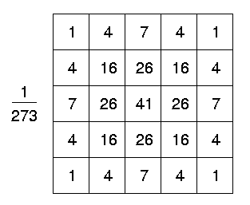
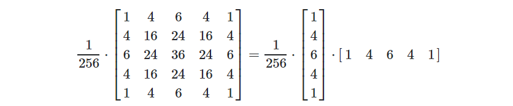

# CANNY EDGE DETECTION
Original                   |  Final
:-------------------------:|:-------------------------:
   |  
 
 

## INTRODUCTION

Canny edge detection is a image processing method used to detect edges in an image while suppressing noise. The main steps are as follows:

* Step 1 - Grayscale Conversion

* Step 2 - Gaussian Blur

* Step 3 - Determine the Intensity Gradients

* Step 4 - Non Maximum Suppression

* Step 5 - Double Thresholding

* Step 6 - Edge Tracking by Hysteresis

* Step 7 - Cleaning Up

## ALGORITHM STEPS

### STEP 1 - GRAYSCALE CONVERSION

Convert the image to grayscale.

Original                   |  Black and White
:-------------------------:|:-------------------------:
   |  

There are two methods to convert color image into a grayscale image. Both has their own merits and demerits. The methods are:

* Average method

* Weighted method or luminosity method

#### Average method

Average method is the most simple one. You just have to take the average of three colors. Since its an RGB image, so it means that you have add r with g with b and then divide it by 3 to get your desired grayscale image:

Grayscale = (R + G + B / 3)

For example:

Original                   |  Grayscale (avg)
:-------------------------:|:-------------------------:
   |  

##### Explanation
There is one thing to be sure, that something happens to the original works. It means that our average method works. But the results were not as expected. We wanted to convert the image into a grayscale, but this turned out to be a rather black image.

##### Problem
This problem arise due to the fact, that we take average of the three colors. Since the three different colors have three different wavelength and have their own contribution in the formation of image, so we have to take average according to their contribution, not done it averagely using average method. Right now what we are doing is this,

33% of Red,	33% of Green, 33% of Blue

We are taking 33% of each, that means, each of the portion has same contribution in the image. But in reality thats not the case. The solution to this has been given by luminosity method.

#### Weighted method or luminosity method

You have seen the problem that occur in the average method. Weighted method has a solution to that problem. Since red color has more wavelength of all the three colors, and green is the color that has not only less wavelength then red color but also green is the color that gives more soothing effect to the eyes.

It means that we have to decrease the contribution of red color, and increase the contribution of the green color, and put blue color contribution in between these two.

So the new equation that form is:

New grayscale image = ( (0.3 * R) + (0.59 * G) + (0.11 * B) ).

According to this equation, Red has contribute 30%, Green has contributed 59% which is greater in all three colors and Blue has contributed 11%.

Applying this equation to the image, we get this

Original                   |  Grayscale (luminosity)
:-------------------------:|:-------------------------:
   |  

##### Explanation
As you can see here, that the image has now been properly converted to grayscale using weighted method. As compare to the result of average method, this image is more brighter.

### STEP 2 - GAUSSIAN BLUR

Perform a Gaussian blur on the image. The blur removes some of the noise before further processing the image. A sigma of 1.4 is used in this example and was determined through trial and error.

Gaussian Blur                   
:-------------------------:

Mathematically, applying a Gaussian blur to an image is the same as ***convolving*** the image with a Gaussian function. This is also known as a ***two-dimensional Weierstrass transform***. 

Specifically, a Gaussian kernel (used for Gaussian blur) is a square array of pixels where the pixel values correspond to the values of a Gaussian curve (in 2D).

Gaussian kernel                   
:-------------------------:

Each pixel in the image gets multiplied by the Gaussian kernel. This is done by placing the center pixel of the kernel on the image pixel and multiplying the values in the original image with the pixels in the kernel that overlap. The values resulting from these multiplications are added up and that result is used for the value at the destination pixel. Looking at the image, you would multiply the value at (0,0) in the input array by the value at (i) in the kernel array, the value at (1,0) in the input array by the value at (h) in the kernel array, and so on. and then add all these values to get the value for (1,1) at the output image.

Convolution                   
:-------------------------:

Convolution can be done by multiplying each input pixel with the entire kernel. However, if the kernel is symmetrical (which a Gaussian kernel is) you can also multiply each axis (x and y) independently, which will decrease the total number of multiplications. In proper mathematical terms, if a matrix is separable it can be decomposed into (M×1) and (1×N) matrices. For the Gaussian kernel above this means you can also use the following kernels:

Kernel Decomposition                   
:-------------------------:

You would now multiply each pixel in the input image with both kernels and add the resulting values to get the value for the output pixel.

##### Additional resourse:

If the 2D filter kernel has a rank of 1 then it is separable.

But how can we determine the outer product vectors? The answer is to go back to the svd function. Here's a snippet: 
[U,S,V] = svd(X) produces a diagonal matrix S of the same dimension as X, with nonnegative diagonal elements in decreasing order, and unitary matrices U and V so that X = U*S*V'.
A rank 1 matrix has only one nonzero singular value, so U*S*V' becomes U(:,1) * S(1,1) * V(:,1)'. This is basically the outer product we were seeking. Therefore, we want the first columns of U and V. (We have to remember also to use the nonzero singular value as a scale factor.)

